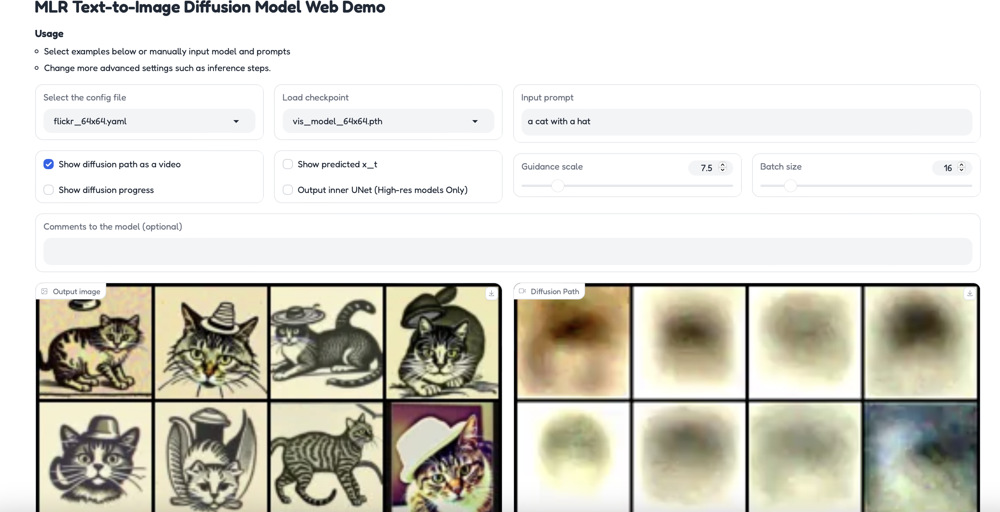

# ml_mdm - Matryoshka Diffusion Models

`ml_mdm` is a python package for efficiently training high quality text-to-image diffusion models — brought to the public by [Luke Carlson](https://github.com/luke-carlson), [Jiatao Gu](https://github.com/MultiPath), [Shuangfei Zhai](https://github.com/Shuangfei), and [Navdeep Jaitly](https://github.com/ndjaitly).


---


<div align="center">


This software project accompanies the research paper, [*Matryoshka Diffusion Models*](https://arxiv.org/abs/2310.15111).


*Jiatao Gu, Shuangfei Zhai, Yizhe Zhang, Josh Susskind, Navdeep Jaitly*

[[`Paper`](https://arxiv.org/abs/2310.15111)]  [[`BibTex`](#citation)]


</div>


## Table of Contents

| Section | Description |
| - | - |
| [Introduction](#introduction) | A brief overview of Matryoshka Diffusion Models |
| [Installation](#installation) | Start training models and generating samples with `ml_mdm` |
| [Pretrained Models](#pretrained-models) | Links to download our pretrained models (64, 256, 1024) |
| [Web Demo](#web-demo) | Generate images with our web UI |
| [Codebase Structure](#codebase) | An overview of the python module |
| [Concepts](#concepts) | Core concepts and design principles. |
| [Tutorial](#tutorials) | Step-by-step training of an MDM model on CC12m |


## Introduction

Diffusion models are the de facto approach for generating high-quality images and videos, but learning high-dimensional models remains a formidable task due to computational and optimization challenges.

`ml_mdm` is an end-to-end framework for high-resolution image and video synthesis — it is named after our technique: *Matryoshka Diffusion Models*.

Remarkably, we can train a single pixel-space model at resolutions of up to 1024x1024 pixels, demonstrating strong zero-shot generalization using the CC12M dataset, which contains only 12 million images.


## Installation
The default installation dependencies, as defined in the `pyproject.toml`, are selected so that you can install this library even on a CPU only machine.

> Users have run this codebase with Python 3.9,3.10 and cuda_12, cuda-11.8

```
> pip install -e .
```

Developers should set up `pre-commit` as well with `pre-commit install`.

### Running Test Cases

```
> pytest   # will run all test cases - including ones that require a gpu
> pytest  -m "not gpu"  # run test cases that can work with just cpu
```


# Pretrained Models
We've uploaded model checkpoints to:
- https://docs-assets.developer.apple.com/ml-research/models/mdm/flickr64/vis_model.pth
- https://docs-assets.developer.apple.com/ml-research/models/mdm/flickr256/vis_model.pth
- https://docs-assets.developer.apple.com/ml-research/models/mdm/flickr1024/vis_model.pth

> Note: We are releasing models that were trained on 50M text-image pairs collected from Flickr. In this repo, we provide scripts for downloading [CC12M](https://github.com/google-research-datasets/conceptual-12m) and configs for training equivalent models on CC12M data.

Feel free to download the models or skip further down to train your own. Once a pretrained model is downloaded locally, you can use it in our web demo, pass it as an argument to training, sampling, and more.

```console
export ASSET_PATH=https://docs-assets.developer.apple.com/ml-research/models/mdm

curl $ASSET_PATH/flickr64/vis_model.pth --output vis_model_64x64.pth
curl $ASSET_PATH/flickr256/vis_model.pth --output vis_model_256x256.pth
curl $ASSET_PATH/flickr1024/vis_model.pth --output vis_model_1024x1024.pth
```


### Web Demo
You can run your own instance of the web demo (after downloading the checkpoints) with this command:

```console
torchrun --standalone --nproc_per_node=1  ml_mdm/clis/generate_sample.py --port $YOUR_PORT
```



## Codebase

| module | description |
| - | - |
| `ml_mdm.models` | The core model implementations |
| `ml_mdm.diffusion` | Model pipelines, for example DDPM |
| `ml_mdm.config` | Connects configuration dataclasses with associated models, pipelines, and clis using [simple parsing](https://github.com/lebrice/SimpleParsing/blob/master/README.md) |
| `ml_mdm.clis` | All command line tools in the project, the most relevant being `train_parallel.py` |
| `tests/` | Unit tests and sample training files |


# Concepts


### ml_mdm.models
In the `ml_mdm.models` submodule, we've open sourced our implementations of:
- U-Nets
- Nested U-Nets


### ml_mdm.config
`ml_mdm.config` contains the core configuration and cli logic. Many models, clis, and functions in this codebase are configured by passing in a `dataclass` object. We use [SimpleParsing](https://github.com/lebrice/SimpleParsing) to dynamically create clis and allow passing in yaml `config` representations with `--config_path`.


> In essence, `simple_parsing` will convert all passed cli arguments and yaml files into clean configuration classes like `ml_mdm.reader.ReaderConfig`, `ml_mdm.diffusion.DiffusionConfig`.


# Tutorials

## Generate Your Own Images With Pretrained Checkpoints

Once you've installed `ml_mdm`, download these checkpoints into the repo's directory.

```console
curl https://docs-assets.developer.apple.com/ml-research/models/mdm/flickr64/vis_model.pth --output vis_model_64x64.pth
curl https://docs-assets.developer.apple.com/ml-research/models/mdm/flickr256/vis_model.pth --output vis_model_256x256.pth
```

The web demo will load each model with a corresponding configuration:
- `vis_model_64x64.pth` will be loaded with the settings from `configs/models/cc12m_64x64.yaml`
- `vis_model_256x256.pth` will be loaded with the settings from `configs/models/cc12m_256x256.yaml`
- `vis_model_1024x1024.pth` will be loaded with the settings from `configs/models/cc12m_1024x1024.yaml`

In the demo, you can change a variety of settings and peek into the internals of the model. Set the port you'd like to use by swapping in `$YOUR_PORT` and then run:

```console
torchrun --standalone --nproc_per_node=1  ml_mdm/clis/generate_sample.py --port $YOUR_PORT
```

## Training on Dummy Data
If you just want to step through the process of training a model and running a pipeline without downloading a large dataset, we've put together a minimal example for you. It uses the dummy data from `tests/test_files/`

> Feel free to try changing a variety of --args either directly in the cli or by editing the config yaml file

```console
torchrun --standalone --nproc_per_node=1 ml_mdm/clis/train_parallel.py \
 --file-list=tests/test_files/sample_training_0.tsv \
 --multinode=0 \
  --output-dir=outputs    --config_path configs/models/cc12m_64x64.yaml \
  -num_diffusion_steps=10 \
	--num-training-steps=10
```

You should see a `outputs/vis_model_000100.pth` file. Now lets do something a bit more meaningful:


## Lets train an MDM model on CC12m

### 1. Data Prep:

**(OPTIONAL) Download the first 1K files of CC12m with this sample argument**

> The script is based on [img2dataset's CC12M script](https://github.com/rom1504/img2dataset/blob/main/dataset_examples/cc12m.md).

```console
curl https://storage.googleapis.com/conceptual_12m/cc12m.tsv | head -n 1000 > cc12m_index.tsv

# Add headers to the file
sed -i '1s/^/url\tcaption\n/'  cc12m_index.tsv
```
>  Note: if you want all of cc12m, remove `| head -n 1000` from the call

Then prepare and split into train/validation

> This script requires `img2dataset`, either run `pip install '.[data_prep]'` or just `pip install img2dataset`

```console
python3 -m ml_mdm.clis.scrape_cc12m \
  --cc12m_index cc12m_index.tsv \
  --cc12m_local_dir cc12m_download
```
After running this command you will see the following files:
```console
training.0.tsv # train index file
validation.tsv # validation index file
cc12m_download/
   00000.parquet  00000.tar  00000.tsv  00000_stats.json  validation.tsv
   00001.parquet ....
```

### 2. Train
Now that we have our training file, we can select a model config and pass any additional training arguments:

```console
# Modify torchrun arguments to fit your GPU setup
torchrun --standalone --nproc_per_node=8 ml_mdm/clis/train_parallel.py \
  --file-list=training_0.tsv \
  --multinode=0 --output-dir=/mnt/data/outputs \
  --config_path configs/models/cc12m_64x64.yaml \
  --num-training-steps=100   --warmup-steps 10
```
> Note: `configs/models/cc12m_64x64.yaml` contains many more arguments, check it out for more details.

> If you've downloaded a pretrained model, you can set the `--pretrained-vision-file` argument to point to its location on disk

Once training completes, you'll find the model in the folder defined by the --output-dir argument:
```console
2024-07-22:17:58:46,649 INFO     [model_ema.py:33] Saving EMA model file: /mnt/data/outputs/vis_model_000100.pth
2024-07-22:17:58:47,448 INFO     [unet.py:794] Saving model file: /mnt/data/outputs/vis_model_noema_000100.pth
```


### 3. Sample from the model
Now that we have a trained model, we can generate samples from the diffusion model:
```console
torchrun --standalone --nproc_per_node=1 ml_mdm/clis/generate_batch.py \
  --config_path configs/models/cc12m_64x64.yaml \
  --min-examples 3 --test-file-list validation.tsv \
  --sample-image-size 64 --model-file /mnt/data/outputs/vis_model_000100.pth
```

> If you want to skip the training step, you can update `--model-file` to point to one of our pretrained models


### Dataset Storage

For long term storage, you can optionally upload your data to `s3://{your_bucket}/datasets/{datasetname}/*.[tar,tsv]`.

Then update `configs/datasets/cc12m.yaml` to point to your s3 paths.

```yaml
# configs/datasets/cc12m.yaml
train:
  files:
    - s3://mlx/datasets/cc12m-64x64/images_00.*.tsv
eval:
  files:
    - s3://mlx/datasets/cc12m-64x64/validation.tsv
```

```yaml
# configs/datasets/reader_config.yaml
reader_config:
  append_eos: true
  bucket: ${your_bucket} # add your s3 bucket
  endpoint_url: None # boto will automatically infer the endpoint
```


Then you can use our dataset download helper:
```console
python -m ml_mdm.clis.download_tar_from_index \
  --dataset-config-file configs/datasets/cc12m.yaml \
  --subset train --download_tar

python -m ml_mdm.clis.download_tar_from_index \
  --dataset-config-file configs/datasets/cc12m.yaml \
  --subset eval --download_tar
```

### S3 Dataset Selection

Take a look at `configs/datasets/cc12m.yaml`.

The code allows for multiple regular expressions to be provided. Keep in mind that the
regular expressions are not globs -- they are regular expressions from the python re library.
So if you wanted to use only 100 of the 1000 tar files in WebImage for training you can
do the following:

```yaml
train:
  files:
    - s3://mlx/datasets/example-dataset-100M_64px/example-dataset-100M-00[0-1]..-[0-9]*-of-01000.tsv
eval:
  files:
    - s3://mlx/datasets/example-dataset-100M_64px/validation.tsv
```

You can also mix and match the files. So if you wanted to merge CC12m and imagenet you could
create a new yaml file with the following contents:

```yaml
train:
  files:
    - s3://mlx/datasets/imagenet-64px/imagenet-train-000??-of-00100.tsv
    - s3://mlx/datasets/cc12m-64x64/images_00.*.tsv
eval:
  files:
    - s3://mlx/datasets/cc12m-64x64/validation.tsv
```

### Dataset Structure
The S3 Bucket contains a series of files in this format, take a look at `ml_mdm/clis/scrape_cc12m.py` to generate your own.
```console
2023-04-01 01:31:30   36147200 images_00000.tar
2023-05-10 11:34:49    1108424 images_00000.tsv
2023-04-01 01:31:26   36454400 images_00001.tar
2023-05-10 11:34:49    1109588 images_00001.tsv
2023-04-01 01:31:53   36116480 images_00002.tar
...
```

Minimal representations of these files can be found at `tests/test_files/`.


## Citation
If you find our work useful, please consider citing us as:
```
@misc{gu2023matryoshkadiffusionmodels,
      title={Matryoshka Diffusion Models},
      author={Jiatao Gu and Shuangfei Zhai and Yizhe Zhang and Josh Susskind and Navdeep Jaitly},
      year={2023},
      eprint={2310.15111},
      archivePrefix={arXiv},
      primaryClass={cs.CV},
      url={https://arxiv.org/abs/2310.15111},
}
```
